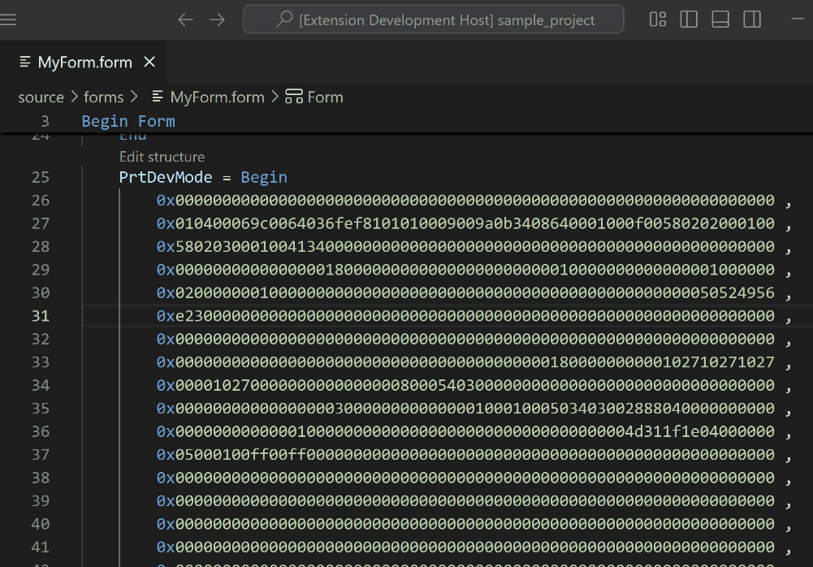

# MS Access Dump Format

## About

Microsoft Access allows you to [dump internal resources](https://stackoverflow.com/questions/187506/how-do-you-use-version-control-with-access-development) (forms, macros, queries, reports, etc.) into separate files through its COM interface. This enables collaborative development of Access applications with multiple developers working simultaneously.

This VS Code extension provides comprehensive language support for MS Access dump files, making it easier to read, navigate, and maintain these files with advanced syntax highlighting and intelligent code analysis.

## Features

- **Advanced Syntax Highlighting** - Full syntax support for MS Access dump format (forms, macros, queries, reports)
- **Embedded Language Support** - Syntax highlighting for SQL and Visual Basic code within dump files
- **Smart Navigation** - Breadcrumbs support for easy file navigation
- **Color Picker Integration** - Interactive color picker for color values
- **PrtDevMode(W) Support** - Decode, view, and edit printer device mode settings

### Syntax Highlighting


The extension provides comprehensive syntax highlighting and breadcrumbs support, making it easier to quickly analyze and understand the structure of your Access dump files.

### PrtDevMode(W) Block Support



The extension can decode and display printer device mode settings stored in PrtDevMode(W) blocks. You can:

- **Hover** over a PrtDevMode(W) block to view its stored information
- **Use Code Lens** to edit the settings directly in a user-friendly interface

## Configuration

### File Association

This extension automatically recognizes files with the following extensions:

- `*.form` - Access forms
- `*.mac` - Access macros  
- `*.qry` - Access queries
- `*.report` - Access reports

### Custom File Extensions

If your project uses different file extensions, you can add custom [file associations](https://code.visualstudio.com/docs/languages/overview#_add-a-file-extension-to-a-language) in your `settings.json`:

```json
{
  "files.associations": {
    "*.frm.txt": "access-dump",
    "*.rpt.txt": "access-dump"
  }
}
```

## Additional Resources

### Development Tools

- [Rubberduck](https://rubberduckvba.com/) - VBA code quality and refactoring tools
- [vbWatchdog](https://www.everythingaccess.com/vbwatchdog.asp) - Error handling and logging for VBA
- [MDB Tools](https://github.com/mdbtools/mdbtools) - Open-source tools for reading MDB files

### Data Migration Tools

Export Access data to other databases:

- [MySQL](https://www.bullzip.com/products/a2m/info.php) (Bullzip A2M)
- [MSSQL](https://www.bullzip.com/products/a2s/info.php) (Bullzip A2S)  
- [PostgreSQL](https://www.bullzip.com/products/a2p/info.php) (Bullzip A2P)

### Access Development Resources

- [Access Ribbon Documentation](https://www.accessribbon.de/en/) - General ribbon customization guide
- [ImageMSO List](https://bert-toolkit.com/imagemso-list.html) - Complete list of built-in Office icons
- [ImageMSO Gallery](http://www.spreadsheet1.com/office-excel-ribbon-imagemso-icons-gallery-page-01.html) - Visual gallery of Office icons
- [Allen Browne's Access Tips](http://allenbrowne.com/tips.html) - Comprehensive Access development tips
- [FMS Access Developer Center](http://www.fmsinc.com/microsoftaccess/developer/index.html) - VBA programming resources

## Support This Project

If this extension has improved your workflow or saved you time, please consider supporting its development:

- ⭐ **[Star this repository](https://github.com/anticultist/vscode-ms-access-dump)** on GitHub
- ☕ **[Buy me a coffee](https://ko-fi.com/anticultist)** to support continued development
- 📝 **[Leave a review](https://marketplace.visualstudio.com/items?itemName=anticultist.ms-access-dump-format)** in the VS Code marketplace
- 📢 **Share it** with other developers working with MS Access

Your support helps keep this project active and enables new features and improvements!
