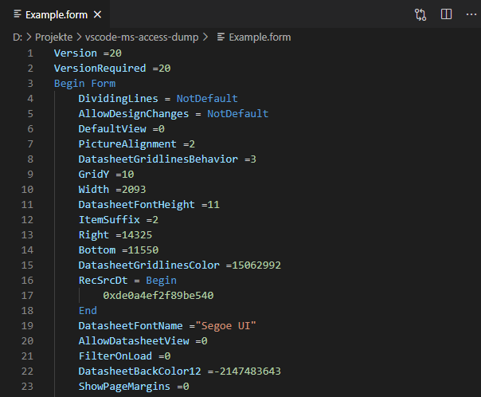

# MS Access Dump Format

Through the COM interface it is possible to dump internal resources (e.g. forms, macros, queries, reports etc.) of a Microsoft Access application into separate files[[1]](https://stackoverflow.com/questions/187506/how-do-you-use-version-control-with-access-development).
This allows to develop such an application with multiple developers simultaneously.
To ease the handling of such files this VSCode extension provides syntax highlighting for that dump format.

Screenshot
----------

VBA Syntax Highlighting
-----------------------

To enable syntax highlighting after the 'CodeBehindForm' tag you can install the following VSCode extension:
- Visual Studio Code VBA [[Marketplace]](https://marketplace.visualstudio.com/items?itemName=aferri.avb)

Related Links
-------------

These links may be interesting to further improve the development.

- [Rubberduck](https://rubberduckvba.com/)
- [vbWatchdog](https://www.everythingaccess.com/vbwatchdog.asp)
- [Access To MySQL [Bullzip]](https://www.bullzip.com/products/a2m/info.php)
- [Access To MSSQL [Bullzip]](https://www.bullzip.com/products/a2s/info.php)
- [Access To PostgreSQL [Bullzip]](https://www.bullzip.com/products/a2p/info.php)
