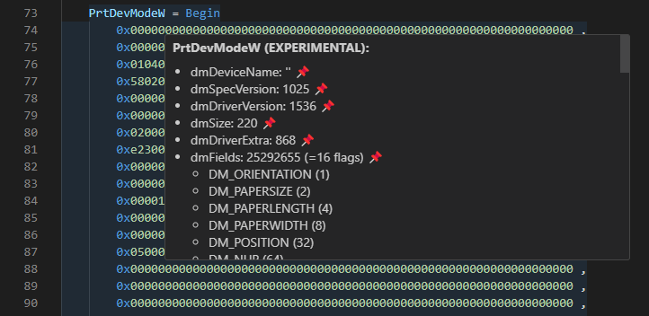

# MS Access Dump Format

## About

Through the COM interface it is possible to dump internal resources (e.g. forms, macros, queries, reports etc.) of a Microsoft Access application into separate files[\[1\]](https://stackoverflow.com/questions/187506/how-do-you-use-version-control-with-access-development).
This allows to develop a Microsoft Access application with multiple developers simultaneously.
To ease the handling of such files this VSCode extension provides syntax highlighting for this custom dump format.

## Call for Sponsorship

This is a **free extension**.
If you find it useful to yourself or your business then you might consider [sponsoring](https://ko-fi.com/anticultist) it.

## Feature Overview

- Syntax highlighting for MS Access dump format (forms, macros, queries, reports)
- embedded syntax highlighting for SQL and Visual Basic
- breadcrumbs support
- color picker
- encoding of the PrtDevMode(W) block

### Syntax highlighting


This extension has syntax highlighting and breadcrumbs support so that the content can be analyzed more quickly.

### PrtDevMode(W)



You can hover over the PrtDevMode(W) block to display the information stored there.

## File Association

This extension has a predefined file association for the following file endings: `*.form`, `*.mac`, `*.qry`, `*.report`.
If your project uses different file endings you can also add new [file association](https://code.visualstudio.com/docs/languages/overview#_add-a-file-extension-to-a-language) in `settings.json`, e.g.:

```json
{
  "files.associations": {
    "*.frm.txt": "access-dump",
    "*.rpt.txt": "access-dump"
  }
}
```

## Useful Links

These links may be interesting to further improve the development.

- [Rubberduck](https://rubberduckvba.com/)
- [vbWatchdog](https://www.everythingaccess.com/vbwatchdog.asp)
- Export Access data to: [MySQL](https://www.bullzip.com/products/a2m/info.php), [MSSQL](https://www.bullzip.com/products/a2s/info.php), [PostgreSQL](https://www.bullzip.com/products/a2p/info.php) \[Bullzip\]
- Using the ribbon menu in Access: [General documentation](https://www.accessribbon.de/en/), [list of imageMSO pictures](https://bert-toolkit.com/imagemso-list.html), [imageMso gallery](http://www.spreadsheet1.com/office-excel-ribbon-imagemso-icons-gallery-page-01.html)
- [Allen Browne's tips for Microsoft Access](http://allenbrowne.com/tips.html)
- [Microsoft Access Developer and VBA Programming Help Center](http://www.fmsinc.com/microsoftaccess/developer/index.html)
- [MDB Tools](https://github.com/mdbtools/mdbtools)

## Feedback

Share your feedback as a [GitHub issue](https://github.com/anticultist/vscode-ms-access-dump/issues/new).
