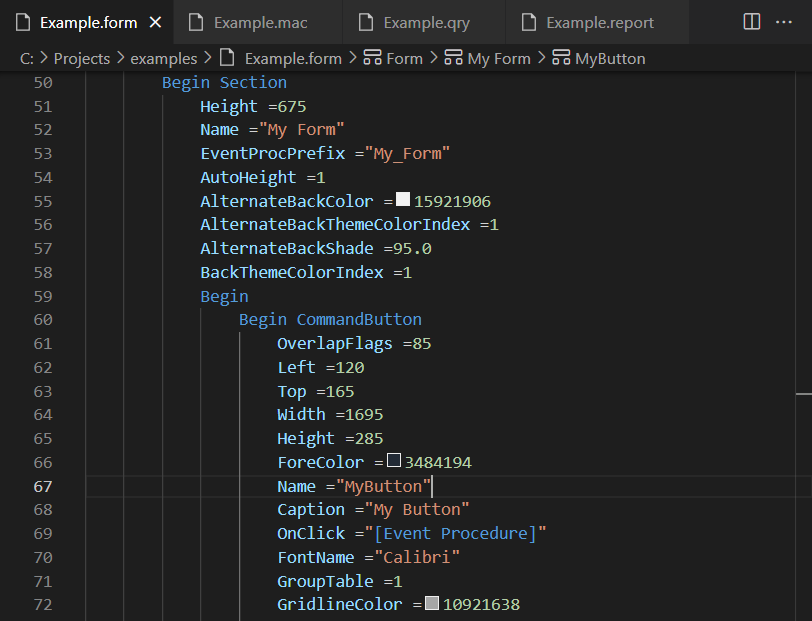

# MS Access Dump Format

Through the COM interface it is possible to dump internal resources (e.g. forms, macros, queries, reports etc.) of a Microsoft Access application into separate files.
This allows to develop such an application with multiple developers simultaneously.
To ease the handling of such files this VSCode extension provides syntax highlighting for that dump format.

Screenshot
----------

VBA Syntax Highlighting
-----------------------

To enable syntax highlighting after the 'CodeBehindForm' tag you can install the following VSCode extension:
- Visual Studio Code VBA [[Marketplace]](https://marketplace.visualstudio.com/items?itemName=aferri.avb)
