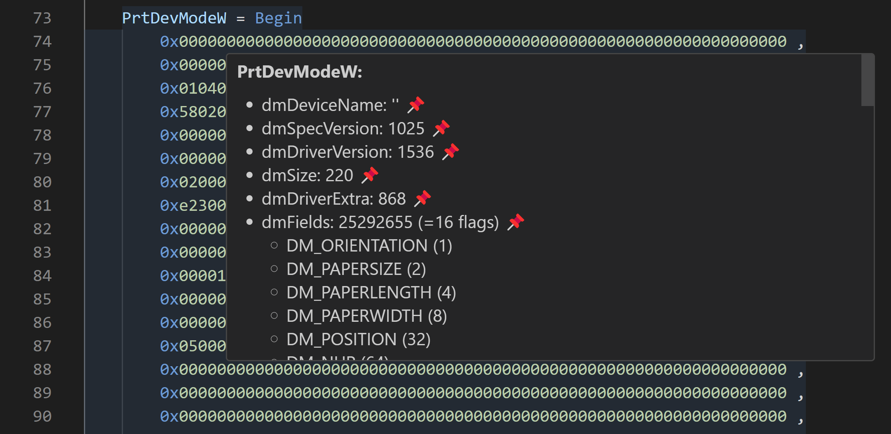

# MS Access Dump Format

## About

Through the COM interface it is possible to dump internal resources (e.g. forms, macros, queries, reports etc.) of a Microsoft Access application into separate files[\[1\]](https://stackoverflow.com/questions/187506/how-do-you-use-version-control-with-access-development).
This allows to develop such an application with multiple developers simultaneously.
To ease the handling of such files this VSCode extension provides syntax highlighting for that dump format.

## Features

- Syntax highlighting for MS Access dump format (forms, macros, queries, reports)
- embedded syntax highlighting for SQL and Visual Basic
- breadcrumbs support
- color picker
- encoding of the PrtDevMode(W) block

## Showcase

## Usage

The easiest way is to export the files with the following file endings: `*.form`, `*.mac`, `*.qry`, `*.report`.
In that case Visual Studio Code will automatically enable the syntax highlighting which is shipped by this extension.
Otherwise you have to manually select `MS Access Dump` as language mode.

## Related Links

These links may be interesting to further improve the development.

- [Rubberduck](https://rubberduckvba.com/)
- [vbWatchdog](https://www.everythingaccess.com/vbwatchdog.asp)
- Export Access data to: [MySQL](https://www.bullzip.com/products/a2m/info.php), [MSSQL](https://www.bullzip.com/products/a2s/info.php), [PostgreSQL](https://www.bullzip.com/products/a2p/info.php) \[Bullzip\]
- Using the ribbon menu in Access: [General documentation](https://www.accessribbon.de/en/), [list of imageMSO pictures](https://bert-toolkit.com/imagemso-list.html), [imageMso gallery](http://www.spreadsheet1.com/office-excel-ribbon-imagemso-icons-gallery-page-01.html)
- [Allen Browne's tips for Microsoft Access](http://allenbrowne.com/tips.html)
- [Microsoft Access Developer and VBA Programming Help Center](http://www.fmsinc.com/microsoftaccess/developer/index.html)
- [MDB Tools](https://github.com/mdbtools/mdbtools)
